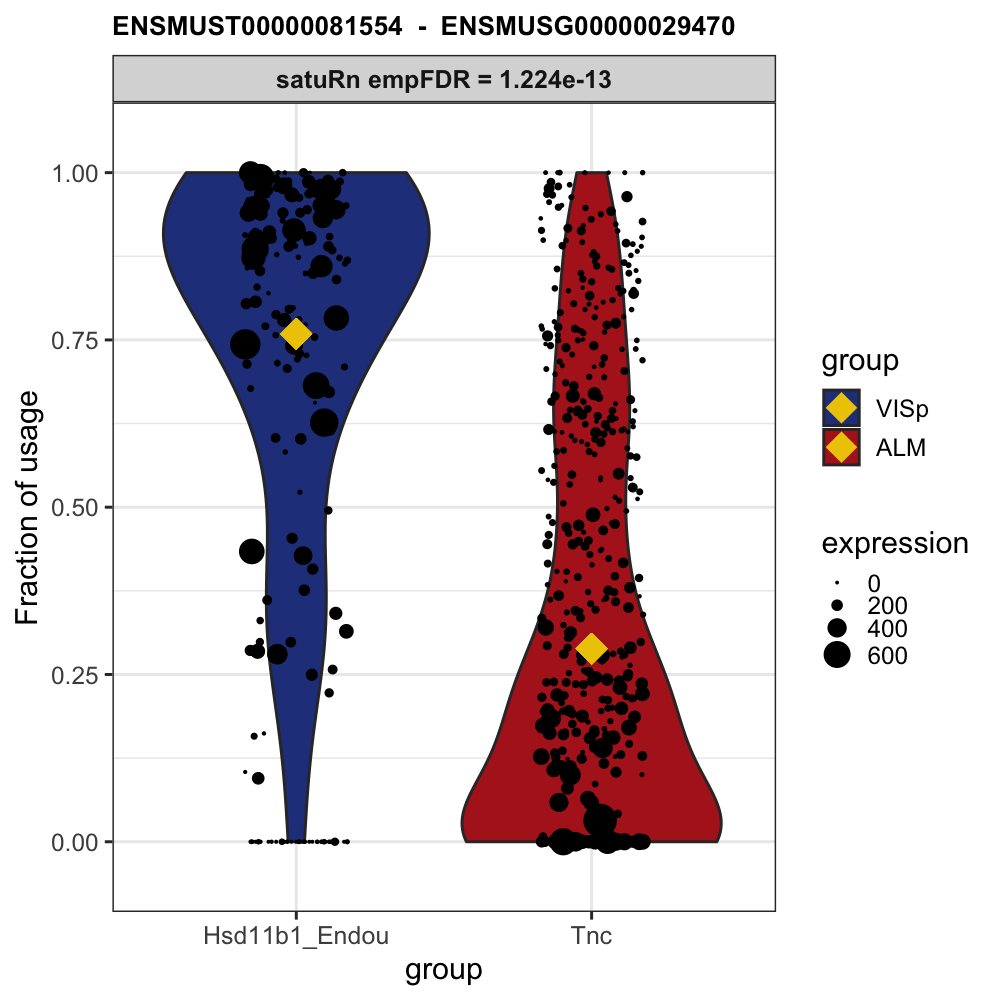

<!-- README.md is generated from README.Rmd. Please edit that file -->

satuRn
======

<!-- badges: start -->

<!-- badges: end -->

satuRn is a highly performant and scalable method for performing
differential transcript usage analyses.

Installation instructions
-------------------------

Get the development version of `satuRn` from
[GitHub](https://github.com/) with:

    devtools::install_github("statOmics/satuRn")

The installation should only take a few seconds. The dependencies of the
package are listed in the DESCRIPTION file of the package.

Issues and bug reports
----------------------

Please use
<a href="https://github.com/statOmics/satuRn/issues" class="uri">https://github.com/statOmics/satuRn/issues</a>
to submit issues, bug reports, and comments.

Usage
-----

A minimal example of the different functions for `modelling`, `testing`
and `visualizing` differential transcript usage is provided. See the
online
[vignette](https://github.com/jgilis/satuRn/blob/master/vignettes/Vignette.Rmd)
for a more elaborate and reproducible example.

    library("satuRn")

    # Provide a transcript expression matrix and corresponding colData and rowData
    sumExp <- SummarizedExperiment::SummarizedExperiment(
        assays = list(counts = Tasic_counts_vignette),
        colData = Tasic_metadata_vignette,
        rowData = txInfo
    )

    # Specify design formula from colData
    metadata(sumExp)$formula <- ~ 0 + as.factor(colData(sumExp)$group)

    # The fitDTU function is used to model transcript usage in different groups of samples or cells.
    sumExp <- satuRn::fitDTU(
        object = sumExp,
        formula = ~0 + group, 
        parallel = FALSE,
        BPPARAM = BiocParallel::bpparam(),
        verbose = TRUE
    )

    # Next we perform differential usage testing using with testDTU
    sumExp <- satuRn::testDTU(object = sumExp, 
                              contrasts = L, 
                              plot = FALSE, 
                              sort = FALSE)

    # Finally, we may visualize the usage of select transcripts in select groups of interest.
    group1 <- rownames(colData(sumExp))[colData(sumExp)$group == "VISp.L5_IT_VISp_Hsd11b1_Endou"]
    group2 <- rownames(colData(sumExp))[colData(sumExp)$group == "ALM.L5_IT_ALM_Tnc"]

    plots <- satuRn::plotDTU(object = sumExp, 
                             contrast = "Contrast1", 
                             groups = list(group1, group2), 
                             coefficients = list(c(0, 0, 1), c(0, 1, 0)), 
                             summaryStat = "model", 
                             transcripts = c("ENSMUST00000081554", "ENSMUST00000195963", "ENSMUST00000132062"), 
                             genes = NULL, 
                             top.n = 6)

    # Example plot from our publication:

Citation
--------

Below is the citation output from using `citation('satuRn')` in R.
Please run this yourself to check for any updates on how to cite
**satuRn**.

    print(citation("satuRn"), bibtex = TRUE)
    #> 
    #> jgilis (2021). _Scalable Analysis of Differential Transcript Usage for Bulk and Single-Cell
    #> RNA-sequencing Applications_. doi: 10.18129/B9.bioc.satuRn (URL:
    #> https://doi.org/10.18129/B9.bioc.satuRn), https://github.com/jgilis/satuRn - R package version 0.99.0,
    #> <URL: http://www.bioconductor.org/packages/satuRn>.
    #> 
    #> A BibTeX entry for LaTeX users is
    #> 
    #>   @Manual{,
    #>     title = {Scalable Analysis of Differential Transcript Usage for Bulk and Single-Cell RNA-sequencing Applications},
    #>     author = {{jgilis}},
    #>     year = {2021},
    #>     url = {http://www.bioconductor.org/packages/satuRn},
    #>     note = {https://github.com/jgilis/satuRn - R package version 0.99.0},
    #>     doi = {10.18129/B9.bioc.satuRn},
    #>   }
    #> 
    #> jgilis (2020). "Scalable Analysis of Differential Transcript Usage for Bulk and Single-Cell
    #> RNA-sequencing Applications." _bioRxiv_. doi: 10.1101/TODO (URL: https://doi.org/10.1101/TODO), <URL:
    #> https://www.biorxiv.org/content/10.1101/TODO>.
    #> 
    #> A BibTeX entry for LaTeX users is
    #> 
    #>   @Article{,
    #>     title = {Scalable Analysis of Differential Transcript Usage for Bulk and Single-Cell RNA-sequencing Applications},
    #>     author = {{jgilis}},
    #>     year = {2020},
    #>     journal = {bioRxiv},
    #>     doi = {10.1101/TODO},
    #>     url = {https://www.biorxiv.org/content/10.1101/TODO},
    #>   }

Please note that the `satuRn` was only made possible thanks to many
other R and bioinformatics software authors, which are cited either in
the vignettes and/or the paper(s) describing this package.

Code of Conduct
---------------

Please note that the `satuRn` project is released with a [Contributor
Code of
Conduct](https://contributor-covenant.org/version/2/0/CODE_OF_CONDUCT.html).
By contributing to this project, you agree to abide by its terms.

Development tools
-----------------

-   Continuous code testing is possible thanks to [GitHub
    actions](https://www.tidyverse.org/blog/2020/04/usethis-1-6-0/)
    through *[usethis](https://CRAN.R-project.org/package=usethis)*,
    *[remotes](https://CRAN.R-project.org/package=remotes)*, and
    *[rcmdcheck](https://CRAN.R-project.org/package=rcmdcheck)*
    customized to use [Bioconductor’s docker
    containers](https://www.bioconductor.org/help/docker/) and
    *[BiocCheck](https://bioconductor.org/packages/3.12/BiocCheck)*.
-   Code coverage assessment is possible thanks to
    [codecov](https://codecov.io/gh) and
    *[covr](https://CRAN.R-project.org/package=covr)*.
-   The [documentation website](http://jgilis.github.io/satuRn) is
    automatically updated thanks to
    *[pkgdown](https://CRAN.R-project.org/package=pkgdown)*.
-   The code is styled automatically thanks to
    *[styler](https://CRAN.R-project.org/package=styler)*.
-   The documentation is formatted thanks to
    *[devtools](https://CRAN.R-project.org/package=devtools)* and
    *[roxygen2](https://CRAN.R-project.org/package=roxygen2)*.

For more details, check the `dev` directory.

This package was developed using
*[biocthis](https://github.com/lcolladotor/biocthis)*.
